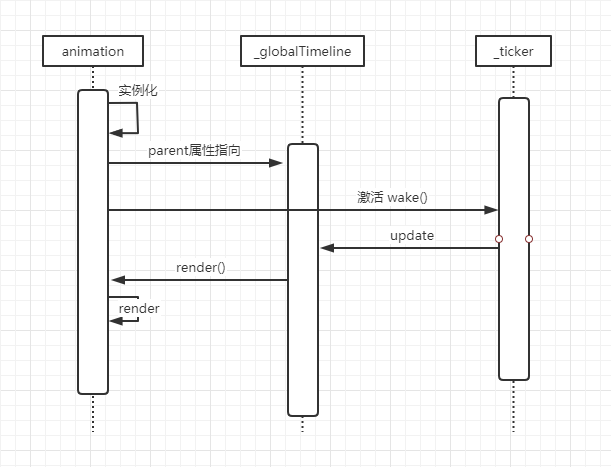

# GSAP源码解析2.0

这次分享是对上一次的补充和纠正。

## 介绍

GSAP是用于移动端和现代互联网的超高性能专业级动画库。


## 深入理解

### 几个关键的全局变量

- _ticker：  定时器对象，使动画按帧播放


实质上是对 `requestAnimationFrame` 和 `setTimeout` 做了兼容处理，然后通过 `wake` 、 `sleep` 方法来控制定时器对开关
```js
_raf = _win.requestAnimationFrame;
_req = _raf || (f => setTimeout(f, ((_nextTime - _self.time) * 1000 + 1) | 0));
```
然后在每帧中遍历执行 `_listeners` 中的函数。（实际上`_listeners`上只有一个元素`updateRoot`）
```js
if (!manual) { 
    _id = _req(_tick);
}
if (dispatch) {
    _listeners.forEach(l => l(_self.time, elapsed, _self.frame, v));
}
```

- _globalTimeline：   GSAP 在初始化时生成的全局时间轴对象，所有创建的动画和时间轴对象到`parent`指针都会默认指向到这个对象上，并在 `updateRoot` 函数中被调用处理。
```js
static updateRoot(time) {
	if (_globalTimeline._ts) {
		_lazySafeRender(_globalTimeline, _parentToChildTotalTime(time, _globalTimeline));
		_lastRenderedFrame = _ticker.frame;
	}
	if (_ticker.frame >= _nextGCFrame) {
		_nextGCFrame += _config.autoSleep || 120;
		let child = _globalTimeline._first;
		if (!child || !child._ts) if (_config.autoSleep && _ticker._listeners.length < 2) {
			while (child && !child._ts) {
				child = child._next;
			}
			if (!child) {
				_ticker.sleep();
			}
		}
	}
}
```


### 核心构造函数

- Animation：   `constructor` 中会执行`_ticker.wake` 唤起计时器。

- Tween：创建动画实例。

- Timeline：创建时间轴实例，组织管理动画。
`render()` 时遍历执行兄弟的`render()`


一个动画或时间轴的生命周期大致如下图所示：

